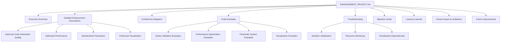

# TRISOLARIS Enhancement Project Documentation Plan

## Overview

This document outlines the plan for creating comprehensive documentation of the TRISOLARIS framework enhancements in `ENHANCEMENT_PROJECT.md`. The documentation will be technically precise while incorporating metaphors and explanations that connect to concepts from psychiatry, biochemistry, neuroscience, philosophy, and astronomy.

## Document Structure



## Section-by-Section Plan

### 1. Executive Summary

This section will provide a high-level overview of the enhancement project, including:
- Brief description of the TRISOLARIS framework
- Summary of the four key enhancements
- Impact of these enhancements on the framework's capabilities
- Overall benefits to users and developers

**Metaphor approach**: The enhanced TRISOLARIS framework will be compared to an evolved nervous system that has developed specialized regions (like the brain's specialized areas) to handle different functions more efficiently.

### 2. Detailed Enhancement Descriptions

#### 2.1 Improved Code Generation Quality (Syntax Validation and Repair)

- Technical details of the SyntaxValidator class
- How it detects and repairs common syntax issues
- The validation and repair workflow
- Performance impact and success rates

**Metaphor approach**: Syntax validation will be compared to the immune system's ability to detect and repair damaged cells, with the repair mechanisms acting like specialized repair enzymes that can fix DNA damage.

#### 2.2 Optimized Performance (Parallel Processing, Caching, Resource-Aware Scheduling)

- Parallel fitness evaluation implementation
- Fitness caching mechanism and benefits
- Resource-aware scheduling details
- Early stopping implementation
- Optimized selection algorithms
- Memory management techniques

**Metaphor approach**: Performance optimizations will be compared to metabolic efficiency improvements in organisms, where parallel processing is like having multiple mitochondria working simultaneously, and caching is like glycogen storage for quick energy access.

#### 2.3 Standardized Parameters (Unified Configuration System)

- Configuration hierarchy and inheritance
- Parameter validation mechanisms
- Component-specific configurations
- Run-specific configurations
- Configuration persistence and loading

**Metaphor approach**: The configuration system will be compared to neurotransmitter regulation in the brain, where different regions need different chemical balances but all follow the same fundamental signaling principles.

#### 2.4 Enhanced Visualization Capabilities

- Interactive vs. static visualizations
- Dashboard creation and customization
- Population diversity metrics visualization
- Syntax error tracking visualization
- Data export capabilities

**Metaphor approach**: Visualization capabilities will be compared to different imaging techniques in medicine (like MRI, CT, PET scans) that provide different perspectives on the same underlying system.

### 3. Architecture Diagrams

This section will include ASCII diagrams showing:
- Overall framework architecture with enhancements highlighted
- Syntax validation and repair workflow
- Parallel processing and resource scheduling architecture
- Configuration hierarchy and inheritance
- Visualization system architecture

### 4. Code Examples

#### 4.1 Syntax Validation and Repair Examples

```python
# Example 1: Basic syntax validation
from trisolaris.core.syntax_validator import SyntaxValidator

code = """
def calculate_sum(a, b)
    return a + b
"""

is_valid, error_msg, error_details = SyntaxValidator.validate(code)
print(f"Valid: {is_valid}, Error: {error_msg}")

# Example 2: Syntax repair
repaired_code, applied_repairs = SyntaxValidator.repair(code)
print(f"Repaired code:\n{repaired_code}")
print(f"Applied repairs: {applied_repairs}")
```

#### 4.2 Performance Optimization Examples

```python
# Example: Configuring performance optimizations
from trisolaris.core.engine import EvolutionEngine

engine = EvolutionEngine(
    population_size=100,
    parallel_evaluation=True,
    max_workers=4,  # Use 4 CPU cores
    use_caching=True,
    early_stopping=True,
    early_stopping_generations=5,
    early_stopping_threshold=0.01,
    resource_aware=True
)
```

#### 4.3 Standardized Parameter System Examples

```python
# Example: Creating and using configurations
from trisolaris.config import BaseConfig, load_config, get_config

# Load global configuration
load_config("config.json")

# Get component-specific configuration
task_config = get_config(component_name="network_scanner")

# Create a custom configuration
custom_config = BaseConfig(
    evolution={"population_size": 50, "mutation_rate": 0.2},
    sandbox={"resource_limits": {"max_cpu_percent": 50}}
)
```

#### 4.4 Visualization Examples

```python
# Example: Creating a visualization dashboard
from trisolaris.visualization import create_visualization_dashboard

dashboard_path = create_visualization_dashboard(
    metrics=evolution_metrics,
    output_dir="./output",
    interactive=True,
    include_plots=["fitness", "diversity", "syntax_errors"]
)
```

### 5. Troubleshooting Section

#### 5.1 Sandbox Initialization Errors

- Description of the issue with parameter naming
- Root cause analysis
- Proper solution (updating parameter names consistently)
- How to verify the fix

#### 5.2 Resource Monitoring Issues

- Description of the missing method issue
- Root cause analysis
- Proper implementation of the can_proceed method
- How to verify the fix

#### 5.3 Visualization Dependency Problems

- Description of the dependency issues
- Required dependencies and installation instructions
- Graceful fallback mechanisms
- How to verify visualization capabilities

### 6. Migration Guide

- Step-by-step guide for upgrading from previous versions
- Configuration file updates
- API changes and deprecations
- New features to adopt immediately vs. gradually

### 7. Lessons Learned

- Importance of consistent parameter naming
- Benefits of unified configuration system
- Value of graceful degradation for optional features
- Impact of performance optimizations on large-scale evolution

### 8. Known Issues and Limitations

- Current limitations of syntax repair for complex errors
- Performance considerations for very large populations
- Visualization limitations without optional dependencies
- Resource monitoring precision on different platforms

### 9. Future Improvement Opportunities

- Advanced syntax repair using machine learning
- Distributed evolution across multiple machines
- More sophisticated resource scheduling algorithms
- Extended visualization capabilities with 3D representations
- Integration with external monitoring systems

## Implementation Approach

1. Create the ENHANCEMENT_PROJECT.md file with the structure outlined above
2. For each section, include:
   - Technical details for AI collaborators
   - Conceptual explanations with metaphors for the user
   - Code examples where appropriate
   - ASCII diagrams for architecture visualization
3. Ensure the troubleshooting section addresses the specific issues encountered during the demonstration
4. The migration guide will provide clear steps for users of previous versions

## Metaphor Strategy

Throughout the document, metaphors will be used from:
- Neuroscience (brain regions, neural networks, neurotransmitters)
- Biochemistry (enzymes, metabolic pathways, cellular repair)
- Psychiatry (cognitive processes, adaptive behaviors)
- Astronomy (cosmic evolution, stellar lifecycles)
- Philosophy (emergence, complex systems)

These metaphors will help bridge the technical details with conceptual understanding, making the documentation both precise and accessible.

## Future Cleanup Task

In a future session, we will:
1. Review the directory structure to identify redundant files
2. Create a "case_studies" folder for valuable examples
3. Move important demonstration files and test cases to this folder
4. Remove truly redundant files to maintain a clean codebase
5. Document the purpose of each case study for future reference