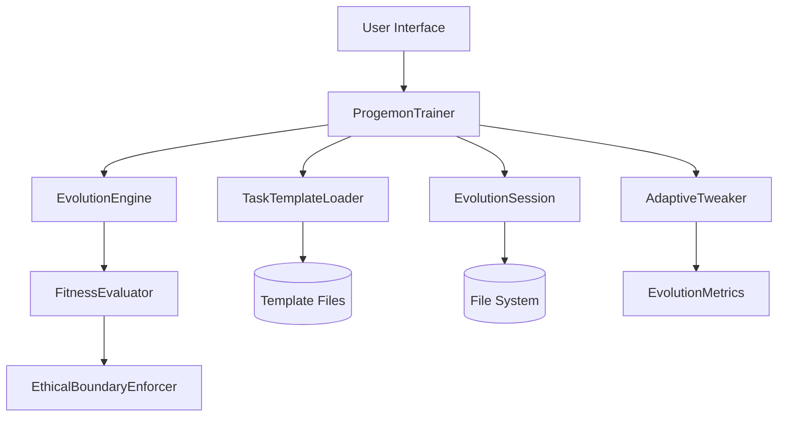

# Progremon Integration Guide

This guide focuses on the integration points between different components in the redesigned Progremon system. It illustrates how data flows through the system and how components interact with each other to create a cohesive codebase.

## System Component Diagram



## Key Integration Points

### 1. ProgemonTrainer ↔ AdaptiveTweaker

**Data Flow:**
- ProgemonTrainer provides fitness metrics to AdaptiveTweaker
- AdaptiveTweaker returns adjusted evolution parameters to ProgemonTrainer

**Integration Code:**
```python
# In ProgemonTrainer.run_evolution()
self.adaptive_tweaker.record_metrics(
    population=population,
    best_fitness=best_fitness,
    avg_fitness=avg_fitness
)
new_params = self.adaptive_tweaker.adjust_parameters()
engine.mutation_rate = new_params["mutation_rate"]
```

**Error Case Handling:**
- If AdaptiveTweaker fails, continue with current parameters
- Log warning but don't interrupt evolution process

### 2. ProgemonTrainer ↔ EvolutionEngine

**Data Flow:**
- ProgemonTrainer configures and initializes EvolutionEngine
- ProgemonTrainer feeds task descriptions and templates to EvolutionEngine
- EvolutionEngine returns evolved solutions to ProgemonTrainer

**Integration Code:**
```python
# Initialize engine
engine = EvolutionEngine(
    population_size=settings["pop_size"],
    evaluator=evaluator,
    genome_class=CodeGenome,
    mutation_rate=settings["mutation_rate"],
    crossover_rate=settings["crossover_rate"],
    elitism_ratio=0.1
)

# Initialize population
template_code = self.template_loader.load_template(settings["task"])
engine.initialize_population(
    size=settings["pop_size"],
    task_description=settings["description"],
    task_type=settings["task"],
    template_code=template_code if template_code else None
)
```

**Error Case Handling:**
- If initialization fails, try with minimal configuration
- If evolution fails mid-process, save any viable solutions found so far

### 3. EvolutionEngine ↔ FitnessEvaluator

**Data Flow:**
- EvolutionEngine sends genomes to FitnessEvaluator for assessment
- FitnessEvaluator returns fitness scores for each genome

**Integration Code:**
```python
# In EvolutionEngine
def evaluate_population(self):
    fitness_scores = []
    for genome in self.population:
        try:
            # Run the ethical filter first
            if self.evaluator.ethical_filter and not self.evaluator.ethical_filter.check(genome):
                fitness_scores.append(float('-inf'))
                continue
                
            # Evaluate fitness
            fitness = self.evaluator.evaluate(genome)
            genome.fitness = fitness
            fitness_scores.append(fitness)
        except Exception as e:
            logging.error(f"Error evaluating genome: {str(e)}")
            fitness_scores.append(float('-inf'))
    
    return fitness_scores
```

**Error Case Handling:**
- If evaluation fails, assign minimum fitness
- Continue with other genomes instead of stopping entire process

### 4. FitnessEvaluator ↔ EthicalBoundaryEnforcer

**Data Flow:**
- FitnessEvaluator passes genomes to EthicalBoundaryEnforcer
- EthicalBoundaryEnforcer returns pass/fail decision based on ethical rules

**Integration Code:**
```python
# In FitnessEvaluator
def evaluate(self, genome):
    # Check ethical boundaries first
    if self.ethical_filter and not self.ethical_filter.check(genome):
        return float('-inf')  # Unethical solutions get minimum fitness
        
    # Proceed with regular evaluation
    # ...
```

**Modified EthicalBoundaryEnforcer:**
```python
# In EthicalBoundaryEnforcer
def check(self, genome):
    # Get code from genome using proper accessor method
    code = self._get_code_from_genome(genome)
    if not code:
        return False
        
    # Check against boundaries
    # ...
    
def _get_code_from_genome(self, genome):
    """Extract code from genome using a flexible approach."""
    # Try multiple access methods to increase compatibility
    if hasattr(genome, 'code'):
        return genome.code
    elif hasattr(genome, 'to_source'):
        return genome.to_source()
    elif hasattr(genome, 'source'):
        return genome.source
    else:
        return str(genome)  # Last resort, might not work well
```

### 5. ProgemonTrainer ↔ TaskTemplateLoader

**Data Flow:**
- ProgemonTrainer requests templates based on task type
- TaskTemplateLoader loads and returns appropriate template code

**Integration Code:**
```python
# In ProgemonTrainer
def _get_template_for_task(self, task_type):
    """Get appropriate template for the specified task."""
    template = self.template_loader.load_template(task_type)
    if not template:
        logging.warning(f"No template found for task type: {task_type}")
        # Use empty template as fallback
        return ""
    return template
```

**Error Case Handling:**
- If template not found, use sensible defaults
- Log warning for missing templates

### 6. ProgemonTrainer ↔ EvolutionSession  

**Data Flow:**
- ProgemonTrainer creates and configures EvolutionSession
- EvolutionSession manages output directories and files
- ProgemonTrainer updates session with progress and results

**Integration Code:**
```python
# In ProgemonTrainer.run_evolution()
self.session = EvolutionSession(
    base_dir=settings["output_dir"],
    task_type=settings["task"]
)

# During evolution loop
self.session.update_stats(gen, best_fitness)

# After evolution completes
best_solution = engine.get_best_solution()
solution_path = self.session.save_best_solution(best_solution.to_source())
self.session.complete()
```

**Error Case Handling:**
- If file operations fail, log error and continue
- Ensure session metadata is still updated even if solution saving fails

## Data Structure Integration

### 1. Genome Representation

Ensure consistent genome structure across components:

```python
class CodeGenome:
    """Representation of code as a genome for evolution."""
    
    def __init__(self, source_code=""):
        self.source_code = source_code
        self.fitness = float('-inf')
        self.metadata = {}
    
    def to_source(self):
        """Get source code representation."""
        return self.source_code
    
    def __str__(self):
        """String representation for logging."""
        return f"CodeGenome(fitness={self.fitness}, length={len(self.source_code)})"
```

### 2. Configuration Structure

Maintain consistent configuration structure between components:

```python
default_config = {
    # Basic evolution parameters
    "pop_size": 50,
    "gens": 25,
    "mutation_rate": 0.15,
    "crossover_rate": 0.7,
    
    # Fitness and ethical parameters
    "ethics_level": "basic",
    "max_execution_time": 10.0,
    "max_memory_usage": 500,
    
    # Task-specific parameters
    "task": "general",
    "allowed_libraries": [],
    "update_interval": None,
    "output_format": "text",
    
    # System parameters
    "output_dir": "evolved_output",
    "save_all_generations": True,
    "input_dir": "guidance"
}
```

## Integration Test Cases

### 1. End-to-End Test

Test the entire workflow from request parsing to solution generation:

```python
def test_bluetooth_scanner_end_to_end():
    """Test the complete process for bluetooth scanner generation."""
    trainer = ProgemonTrainer()
    request = "create a bluetooth scanner that updates every 0.5 seconds in table format"
    
    # Process request
    config = trainer.process_request(request)
    assert config["task"] == "bluetooth_scan"
    assert config["update_interval"] == 0.5
    assert config["output_format"] == "table"
    
    # Run minimal evolution (2 generations)
    config["gens"] = 2
    config["pop_size"] = 5
    success = trainer.run_evolution(config)
    assert success
    
    # Verify output
    best_solution_path = trainer.session.base_dir / "best_solution" / "best.py"
    assert best_solution_path.exists()
    
    with open(best_solution_path, 'r') as f:
        code = f.read()
        assert "bluetooth" in code
        assert "0.5" in code
        assert "format_as_table" in code
```

### 2. Component Integration Test

Test specific component integrations:

```python
def test_ethical_enforcer_integration():
    """Test that ethical boundaries are enforced during evolution."""
    # Create components
    evaluator = FitnessEvaluator()
    enforcer = EthicalBoundaryEnforcer()
    
    # Configure boundaries
    enforcer.add_boundary("no_eval_exec")
    enforcer.add_boundary("max_execution_time", max_execution_time=1.0)
    
    # Connect components
    evaluator.ethical_filter = enforcer
    
    # Create test genomes
    good_genome = CodeGenome("print('Hello world')")
    bad_genome = CodeGenome("eval('print(1)')")  # Contains eval, should fail
    
    # Test evaluation
    assert evaluator.evaluate(good_genome) > float('-inf')
    assert evaluator.evaluate(bad_genome) == float('-inf')  # Should fail ethical check
```

## Troubleshooting Common Integration Issues

### 1. AdaptiveTweaker Not Affecting Evolution

**Problem Signs:**
- Parameters stay constant throughout evolution
- No log messages about parameter adjustments

**Debugging Steps:**
1. Verify that record_metrics is being called with valid data
2. Check if adjust_parameters returns different values than input
3. Confirm parameter changes are applied to the engine

**Solution:**
- Add debugging prints to track parameter flow
- Ensure engine mutation rate is being updated, not just stored

### 2. Ethical Filter Rejecting All Solutions

**Problem Signs:**
- All genomes have -inf fitness
- No progress in evolution

**Debugging Steps:**
1. Log what rule is causing rejection
2. Test ethical filter independently with simple code
3. Check if code accessor method is working

**Solution:**
- Implement more flexible code extraction from genomes
- Add debugging mode to show rejection reasons
- Temporarily reduce strictness of ethical rules during testing

### 3. Templates Not Being Applied

**Problem Signs:**
- Generated code lacks expected template structures
- Basic functionality missing in solutions

**Debugging Steps:**
1. Verify template is being loaded correctly
2. Check that template is passed to initialization
3. Inspect how template is incorporated into genomes

**Solution:**
- Add logging of template loading process
- Verify template directory paths
- Ensure template code is properly incorporated into initial population

## Monitoring and Logging Integration

For effective debugging and monitoring, integrate logging throughout the components:

```python
# In ProgemonTrainer
def _setup_logging(self):
    # Configure root logger
    logging.basicConfig(
        level=logging.DEBUG,
        format='%(asctime)s - %(name)s - %(levelname)s - %(message)s',
        filename=f"progremon_{datetime.datetime.now().strftime('%Y%m%d_%H%M%S')}.log"
    )
    
    # Add component-specific loggers
    self.logger = logging.getLogger("ProgemonTrainer")
    self.engine_logger = logging.getLogger("EvolutionEngine")
    self.enforcer_logger = logging.getLogger("EthicalEnforcer")
    
    # Add console handler for important messages
    console = logging.StreamHandler()
    console.setLevel(logging.INFO)
    formatter = logging.Formatter('%(levelname)s: %(message)s')
    console.setFormatter(formatter)
    logging.getLogger('').addHandler(console)
```

By following this integration guide along with the architectural plan and implementation guidelines, you'll create a robust, well-integrated system that evolves code effectively while maintaining proper boundaries, adaptive optimization, and comprehensive error handling.