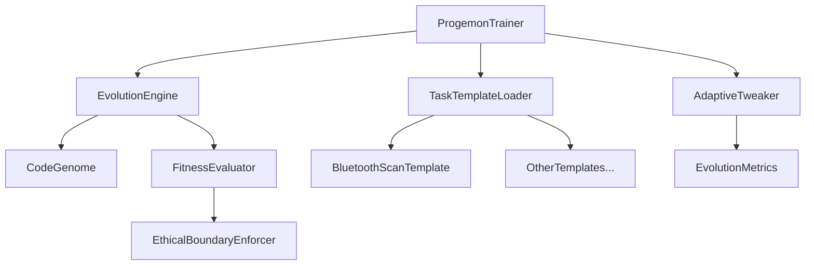
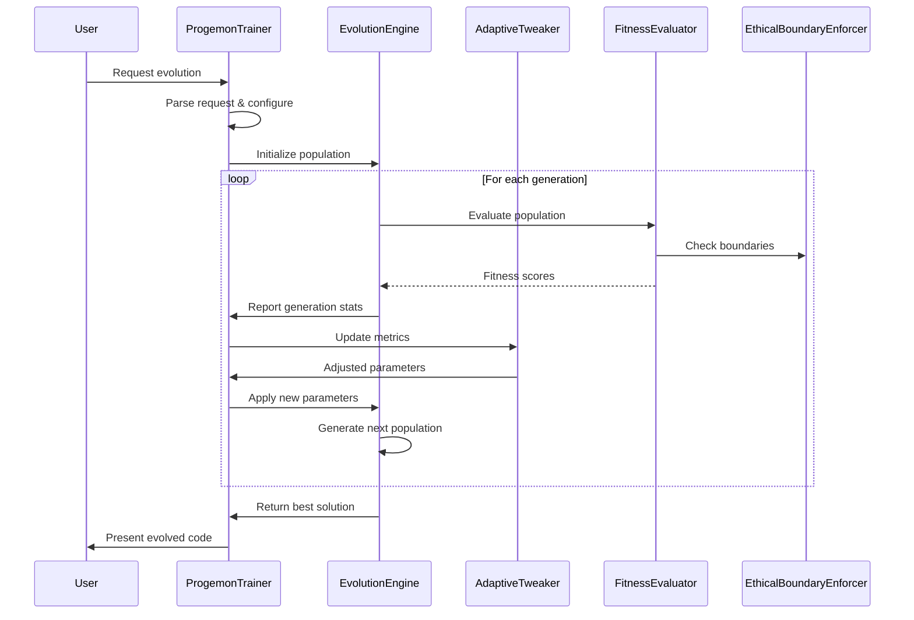

# Progremon Architecture & Implementation Plan

## Overview

This document outlines the architectural plan for rewriting `progremon.py`, focusing on fixing critical issues while ensuring proper integration with the Trisolaris evolution system. The goal is to create a robust implementation that successfully evolves code, particularly for Bluetooth scanning functionality.

## Core Issues Identified

1. **AdaptiveTweaker Integration**
   - Missing Color imports causing runtime errors
   - Parameter tweaking not properly integrated into the evolution loop
   - Feedback from fitness metrics not properly applied

2. **Ethical Boundary Enforcement**
   - `ethical_filter` unable to access `genome.code` 
   - Boundary checking not applied at the right stages of evolution
   - Insufficient validation before execution

3. **Output File Management**
   - Redundant file naming causing overwrites
   - Misconfigured save directories
   - Lack of session-based organization

4. **Parameter Customization**
   - Config settings not properly propagated to components
   - Task-specific settings not properly applied
   - Missing validation of user-provided values

5. **Bluetooth Scanning Configuration**
   - Template code not properly incorporated
   - Task-specific parameters not correctly initialized
   - Insufficient guidance for evolving scan functionality

6. **Error Handling**
   - Overly broad exception handling
   - Insufficient logging for debugging
   - No graceful degradation mechanisms

## Architecture Plan

### 1. Core Components & Dependencies

### 2. Process Flow

### 3. Implementation Strategy

#### A. Core Fixes

1. **Fix AdaptiveTweaker Integration**
   - Import Colors class properly in adaptive_tweaker.py
   - Update update_parameters method to correctly handle fitness metrics
   - Ensure proper population object access

2. **Fix Ethical Boundary Enforcement**
   - Modify to work with CodeGenome's actual structure
   - Implement pre-evaluation validation
   - Add task-specific boundary rules

3. **Improve File Management**
   - Implement unique file naming scheme with timestamps
   - Create proper directory structure for evolution runs
   - Add metadata to saved files

4. **Enhance Parameter Handling**
   - Validate parameters against allowed ranges
   - Create task-specific parameter configuration
   - Implement proper parameter propagation

#### B. Bluetooth Scanning Enhancements

1. **Template Integration**
   - Load appropriate template based on task type
   - Merge template with evolved code
   - Ensure proper imports and dependencies

2. **Bluetooth-Specific Configuration**
   - Configure appropriate parameters for scanning
   - Set proper update intervals and formats
   - Add device detection heuristics

3. **Output Formatting**
   - Implement table formatting for scan results
   - Add real-time update capability
   - Include signal strength visualization

#### C. Robustness Improvements

1. **Error Handling**
   - Implement structured logging with context
   - Create recovery mechanisms for common failures
   - Add graceful degradation paths

2. **Type Safety**
   - Add comprehensive type hints throughout
   - Implement runtime type checking for key functions
   - Add validation for user inputs

3. **Testing Support**
   - Add hooks for automated testing
   - Create debug output modes
   - Implement simulation capabilities

## Implementation Phases

1. **Core Structure Rewrite**
   - Fix import structure and class definitions
   - Implement proper initialization sequence
   - Set up proper error handling

2. **Integration Fixes**
   - Fix Trisolaris component integration
   - Implement proper parameter passing
   - Fix ethical boundary enforcement

3. **Bluetooth Scanner Enhancement**
   - Implement template loading and integration
   - Add bluetooth-specific parameters
   - Create output formatting

4. **Testing & Validation**
   - Test with various inputs
   - Verify error handling
   - Validate output quality

## Key Methods to Implement

1. `ProgemonTrainer.__init__()`
   - Proper initialization of components
   - Setting up logging and output directories

2. `ProgemonTrainer.parse_request()`
   - Enhanced task detection
   - Better parameter extraction

3. `ProgemonTrainer.run_evolution()`
   - Robust error handling
   - Proper integration with components

4. `AdaptiveTweaker.update_parameters()`
   - Proper metric tracking
   - Intelligent parameter adjustment

5. `BluetoothTaskTemplate.initialize()`
   - Load template code
   - Configure task-specific parameters

## Expected Outcomes

1. Successful evolution of Bluetooth scanning code
2. Proper error handling and reporting
3. Adaptive parameter tuning based on evolution progress
4. Clear, well-formatted output
5. Ethical boundary enforcement
6. Session-based organization of results

This architectural plan addresses all identified issues while maintaining compatibility with the existing Trisolaris components. The rewritten code will be robust, maintainable, and produce high-quality evolved solutions.